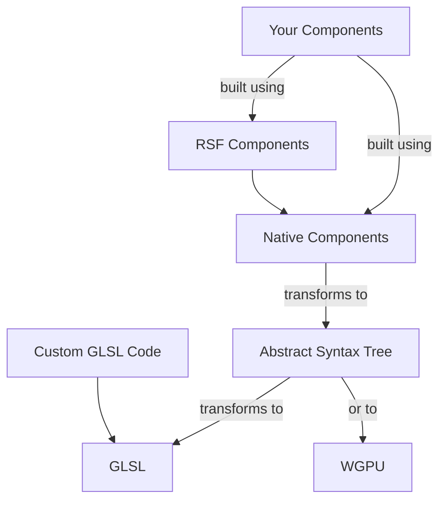

# How It Works?

### AST

Any program, including Shader Programs, can be represented by an Abstract Syntax Tree (AST), which can then be converted
back into program source code. React Shader Fiber uses
the [Shader-AST](https://github.com/thi-ng/umbrella/tree/develop/packages/shader-ast) library to convert any operation
or expression into an Abstract Syntax Tree (AST).

RSF converts React Components into AST. Each component represents an expression from the GLSL language. For example:

```jsx
// The following React Shader Fiber code
<Add>
    <Vec2 x={0.1} y={0.9}/>
    <Float value={2.0}/>
</Add>

// in GLSL will look like
vec2(0.1, 0.9) + 2.0
```

### Standart (Native) Components

Components, representing standard operations and expressions of GLSL, are collected in the @react-shader/stdlib package.
Refer to the API Reference for the complete list of supported operations. You can use them to construct your own
components, encapsulating complex logic to be reused across your shaders.

### RSF Components

React Shader Fiber provides some helpful components such as Player, Shader, Color, and others. These are designed to
help you compose and render your shader. If you require more flexibility, you can create your own components.

Below is the structure of the components we discussed.



Here is the structure of main React Shader Fiber packages:

```mermaid
graph TD
  stdlib[@react-shader/stdlib] --> fiber[@react-shader/fiber] --> renderer[@react-shader/renderer]
	your[Your Components] --> fiber
	stdlib --> your
```